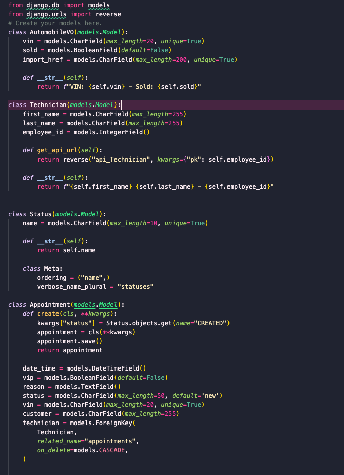

# CarCar

Team:

* Brittany Welborn - Automobile Service
* Brittany Robarge - Automobile Sales

## Design
CarCar is an application that can help businesses manage an automotive dealership. The application is built with three microservices which are inventory, sales, and services. These microservices work together to build the bones of the application by providing all of the required and necessary elements to allow the application to run smoothly. The inventory api has Manufacturer, Vehicle Model, and Automobile API endpoints.

## How to Run this App
1. Open the terminal
2. type command cd to go to the directory where you will clone the project.
3. Clone the projects repo by typing "git clone" with this url: https://gitlab.com/brittanyrobarge26/project-beta.git
4. Type "ls" to see the list of directories, then change the directory to "project-beta".
5. Open Docker desktop and run these commands:

    docker volume create beta-data
    docker-compose build
    docker-compose up

6. It may take a couple minutes for Docker to build, but while you are waiting you can go to localhost:3000 to see when the webpage loads.
**It is good practice to also watch your Docker containers to make sure each one runs, so after Docker is running make sure to check the containers**

## Service microservice

Explain your models and integration with the inventory
microservice, here.




The models in this microservice are:
* AutomobileVO - This model will retieve data within the inventory API with the information of VIN and import_href.
* Technician - This model shows the first name, last name, andn employee id of all the technicians.
* Appointment - This model shows an appointment with a date, time, vip, reason, status, vin, customer, technician, finished status and cancelled status.

With this microservice, you can:
* View lists of appointments and check the VIN and VIP status of a vehicle.
* View the service appointment history of a vehicle by searching the VIN.
* Create an appointment by providing a Vin number, date and time of apppointment, technician, and a reason for the appointment.
* Create a techncian by putting in the name and employee number.

# Diagram


How this all starts is at our inventory domain. We keep a record of automobiles on our lot that are available to buy. Our sales and service microservices obtain information from the inventory domain, using a **poller**, which talks to the inventory domain to keep track of which vehicles we have in our inventory so that the service and sales team always has up-to-date information.

## Accessing Endpoints to Send and View Data: Access Through Insomnia & Your Browser

### Technicians - The heart of what we do here at CarCar


| Action | Method | URL
| ----------- | ----------- | ----------- |
| List technicians | GET | http://localhost:8080/api/technicians/
| Technician detail | GET | http://localhost:8080/api/technicians/<int:pk>/
| Create a technician | POST | http://localhost:8080/api/technicians/
| Delete a technician | DELETE | http://localhost:8080/api/technicians/<int:pk>/


* LIST TECHNICIANS: Following this endpoint will give you a list of all technicians that are currently employed.
* Since this is a GET request, you do not need to provide any data.
```
Example:
{
	"technicians": [
		{
			"name": "Donald",
			"employee_number": 1,
			"id": 1
		}],
```
}

*   TECHNICIAN DETAIL: This is a GET request as well, so no data needs to be provided here either. When you list technicians, you will
*   see that they are assigned a value of "id". This is the value that will replace "<int:pk>. For example, if you wanted to see the technician
*   details related to our technician "Donald", you would input the following address: http://localhost:8080/api/technicians/1/
*   This would then lead to this:

```
{
	"name": "Donald",
	"employee_number": 1,
	"id": 1
}
```
* This how our technician detail is displayed. If you want to change the technician, just change the value at the end to match the "id" of the technician you want to display.

* CREATE TECHNICIAN - What if we hired a new technician (In this economy even)? To create a technician, you would use the following format to input the data and you would just submit this as a POST request.
```
{
	"name": "Liz",
	"employee_number": 2
}
```
* As you can see, the data has the same format. In this example, we just changed the "name" field from "Donald" to "Liz". We also assigned her the "employee_number" value of "2" instead of "1".
* Once we have the data into your request, we just hit "Send" and it will create the technician "Liz". To verify that it worked, just select follow the "LIST TECHNICIAN" step from above to show all technicians.
* With any luck, both Donald and Liz will be there.
* Here is what you should see if you select "LIST TECHNICIAN" after you "CREATE TECHNICIAN" with Liz added in:
```
{
	"technicians": [
		{
			"name": "Donald",
			"employee_number": 1,
			"id": 1
		},
		{
			"name": "Liz",
			"employee_number": 1,
			"id": 2
		}],
}
```

* DELETE TECHNICIAN - If we decide to "go another direction" as my first boss told me, then we need to remove the technician from the system. To do this, you just need to change the request type to "DELETE" instead of "POST". You also need to pull the "id" value just like you did in "TECHNICIAN DETAIL" to make sure you delete the correct one. Once they are "promoted to customer" they will no longer be in our page that lists
* all technicians.


* And that's it! You can view all technicians, look at the details of each technician, and create technicians.
* Remember, the "id" field is AUTOMATICALLY generated by the program. So you don't have to input that information. Just follow the steps in CREATE TECHNICIAN and the "id" field will be populated for you.
* If you get an error, make sure your server is running and that you are feeding it in the data that it is requesting.
* If you feed in the following:
```
{
	"name": "Liz",
	"employee_number": 3,
	"favorite_food": "Tacos"
}

You will get an error because the system doesn't know what what to do with "Tacos" because we aren't ever asking for that data. We can only send in data that Json is expecting or else it will get angry at us.

```


### Service Appointments: We'll keep you on the road and out of our waiting room

| Action | Method | URL
| ----------- | ----------- | ----------- |
| List service appointments | GET | http://localhost:8080/api/appointments/
| Service appointment detail | GET | http://localhost:8080/api/appointments/<int:id>
| Service appointment history | GET | http://localhost:8080/api/appointments/history/<int:vin (OPTIONAL)>
| Create service appointment | POST | http://localhost:8080/api/appointments/create/
| Delete service appointment | DELETE | http://localhost:8080/api/appointments/delete/<int:id>


* LIST SERVICE APPOINTMENT: This will return a list of all current service appointment.
* This is the format that will be displayed.
* Spoiler alert! Remember, the way that it is returned to you is the way that the data needs to be accepted. Remember, the "id" is automatically generated, so you don't need to input that.
* Also, the "date" and "time" fields HAVE TO BE IN THIS FORMAT
```
{
	"service_appointment": [
		{
			"id": 1,
			"vin": "1222",
			"customer_name": "Barry",
			"time": "12:30:00",
			"date": "2021-07-14",
			"reason": "mah tires",
			"vip_status": false,
			"technician": "Liz"
		}],
}
```
SERVICE APPOINTMENT DETAIL: This will return the detail of each specific service appointment.
```
{
	"id": 1,
	"vin": "1222",
	"customer_name": "Barry",
	"time": "12:30:00",
	"date": "2021-07-14",
	"reason": "mah tires",
	"vip_status": false,
	"technician": "Liz"
}
```
* SERVICE APPOINTMENT HISTORY: This will show the detail based on the "VIN" that is input. You will see ALL service appointments for the vehicle associated with the "vin" that you input.
* At the end of the URL, tack on the vin associated with the vehicle that you wish to view. If you leave this field blank, it will show all service history for all vehicles.
```
{
	"service_history": [
		{
			"id": 1,
			"vin": "1222",
			"customer_name": "Barry",
			"time": "12:30:00",
			"date": "2021-07-14",
			"reason": "mah tires",
			"vip_status": false,
			"technician": "Liz"
		},
		{
			"id": 6,
			"vin": "1222",
			"customer_name": "Gary",
			"time": "12:30:00",
			"date": "2021-07-11",
			"reason": "new car",
			"vip_status": false,
			"technician": "Caleb"
		}
	]
}
```
If we add "1222" to the request (eg. http://localhost:8080/api/servicehistory/1222), then it will show the above. If you put a vin that does not exist in the system, it will return a blank list.


* CREATE SERVICE APPOINTMENT - This will create a service appointment with the data input. It must follow the format. Remember, the "id" is automatically generated, so don't fill that in. To verify
* that it was added, just look at your service appointment list after creating a service appointment and it should be there.
```
		{
			"id": 6,
			"vin": "1222",
			"customer_name": "Gary",
			"time": "12:30:00",
			"date": "2021-07-11",
			"reason": "new car",
			"vip_status": false,
			"technician": "Caleb"
		}

```
* DELETE SERVICE APPOINTMENT - Just input the "id" of the service appointment that you want to delete at the end of the url. For example, if we wanted to delete the above service history appointment for Barry
* because we accidently input his name as "Gary", we would just enter 'http://localhost:8080/api/serviceappointment/6' into the field and send the request. We will receive a confirmation message saying that
* the service appointment was deleted.


## Sales microservice

Explain your models and integration with the inventory
microservice, here.
